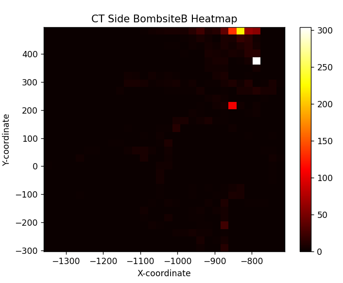

# Evil Geniuses Assessment

## Installation
To run the code, you need to have Python installed on your system. Additionally, you need to install the following dependencies:
* pandas: pip install pandas
* matplotlib: pip install matplotlib

## How to Run
Navigate to the main.py file and hit the run button or type
"python main.py" to start executing the program.

## Results
The results and analysis to the questions can be found below.

## Task 1
#### a. Handle file ingestion and ETL (if deemed necessary)
- def _load_data(self, file): handle the file ingestion and loads
the pandas dataframe into the class

#### b. Return whether or not each row falls within a provided boundary
- def all_rows_within_bounds(self): returns returns all the rows that
are within the blue boundary, it uses the indices specifically so row
count will start at 0

#### c. Extract the weapon classes from the inventory json column
- def extract_weapon_classes(self): returns the following dictionary
{'Pistols': {'USP-S', 'Glock-18', 'Dual Berettas', 'Five-SeveN', 'Tec-9', 'Desert Eagle', 'P250'}, 'Grenade': {'Flashbang', 'Smoke Grenade', 'Molotov', 'HE Grenade', 'Decoy Grenade', 'Incendiary Grenade'}, 'Rifle': {'Galil AR', 'SG 553', 'AK-47', 'SSG 08', 'M4A1', 'FAMAS', 'AWP'}, 'SMG': {'MP9'}}

## Task 2
#### a. Is entering via the light blue boundary a common strategy used by Team2 on T (terrorist) side?
- Entering the light blue boundary is not a common strategy used by
Team2 on T (terrorist) side. I determined this by calculating the frequency of Team2 on T side being in the light blue boundary. Based
on how often their coordinates were in the light blue zone, I used that number and compared to a threshold of 50%. If the coordinates
of Team2 on T side were not in the light blue zone for more than
50% of the time, I deemed it not a common strategy.

#### b. What is the average timer that Team2 on T (terrorist) side enters “BombsiteB” with least 2 rifles or SMGs?
- The average timer that Team2 on T side enters BombsiteB
with at least 2 rife is 39.0147908036336 seconds. This is calculated by filtering the dataframe based on team, side, site, number of players left, and whether bomb is planted. Then the average of
the seconds is taken to get the average time it takes for T side
to come to BombsiteB.

#### c. Now that we’ve gathered data on Team2 T side, let's examine their CT (counter-terrorist) Side. Using the same data set, tell our coaching staff where you suspect them to be waiting inside “BombsiteB”
- The heatmap provided shows all the areas that Team2 on CT side 
frequenly appear in. The brighter spots in the heatmap are areas
that they will likely be waiting for the T side. I achieved this
heatmap by filtering all the dataframe by Team2, CT, and BombsiteB.
Then I plotted all their points into a heatmap.

## Task 3
- The solution I propose to allow the CS:GO coaching staff to request and acquire
ouput for themselves is a web platform using ReactJS for the frontend, and Flask for the 
backend. The frontend should have features that allows the coaching staff to enter
input parameters such as team, weapons, side, etc. The backend is solely responsible
for handling requests and fetching the data from a data storage like a MySQL database.
For the UI, it is imperative to have data visualization in the form of maps, charts, and graphs.
This application is feasible to build in under a week and can be deployed to a cloud service
such as AWS or Azure. Options to export data based on user input should also be possible.

#### Ease of use:
- By abstracting away all the code and providing a user friendly interface,
the coaching staff should have no problem request the data they need. The interface
should be intuitive enough where they can simply hop on and use out of the box, however
documentation and a tutorial will be provided to assist along the way. Through dropdowns,
input fields, and other components, they can effortlessly select the parameters such as
team, side, bombsite, and weapons.

#### Data Visualization and Insights:
- The web platform should also have a feature for data visualization presented in the form
of tables, charts, and heatmaps. This visual approach will allow coaches to know exactly
what site to push, where the enemies will likely be, and other important statistics that
will change the outcome of the game. The platform can have features that will analyze 
the opponents previous matches, and present percentages on where the enemy will likely appear.
Because of this, visualization of data is essential to the platform.

#### Exportation:
- The web platform should also allow the coaching staff to export data based on the input
parameters. This will allow coaching staff to share data with team members and analysts.

#### Customization:
- The specific requirements of the application can be tailored for the specific needs of
the coaching staff. Some recommended features are entering a specific eSports team, and
providing a heatmap of how the like to position their players. Coaching staff should also
be able to filter based on eco rounds, and see what weapons they buy and what side of the
map they like to play more based on certain parameters. These are just a couple ideas
for requirements that will be advantageous for strategy building.